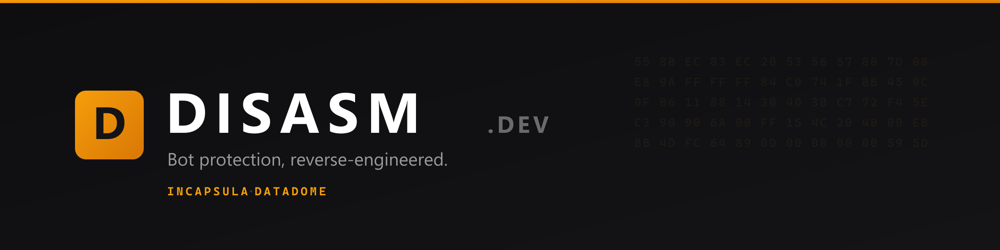

 

**Bypass Incapsula and DataDome with a single HTTP request.**
No headless browsers. No infrastructure to run. Sub-50ms responses.

 

---

### What we build

DISASM is an anti-bot bypass API for developers. We reverse-engineer the major
bot-protection systems and expose them as a clean HTTP endpoint: you send a
request, you get back the sensor, token, or cookie you need. No browser farm,
no fingerprint maintenance, no cat-and-mouse on your side.

The hard part, keeping up with each vendor's detection changes, is ours.

### Coverage

| Protection | What you get |
| --- | --- |
| **Incapsula / Imperva** | `reese84` sensors, `utmvc` cookies, dynamic script handling |
| **DataDome** | Interstitial and slider-CAPTCHA solves, payload generation |

### From the engineering blog

We write up how these systems actually work, and how we get past them.

- [How to Bypass DataDome in 2026: Interstitial & Slider CAPTCHA](https://disasm.dev/blog/how-to-bypass-datadome/)
- [Writing a JavaScript VM in Go](https://disasm.dev/blog/writing-a-javascript-vm-in-go/)

### Get started

1. Read the [docs](https://docs.disasm.dev)
2. Grab a key from the [dashboard](https://dashboard.disasm.dev)
3. Ask us anything in [Discord](https://discord.gg/ukxJm45r7Q)
